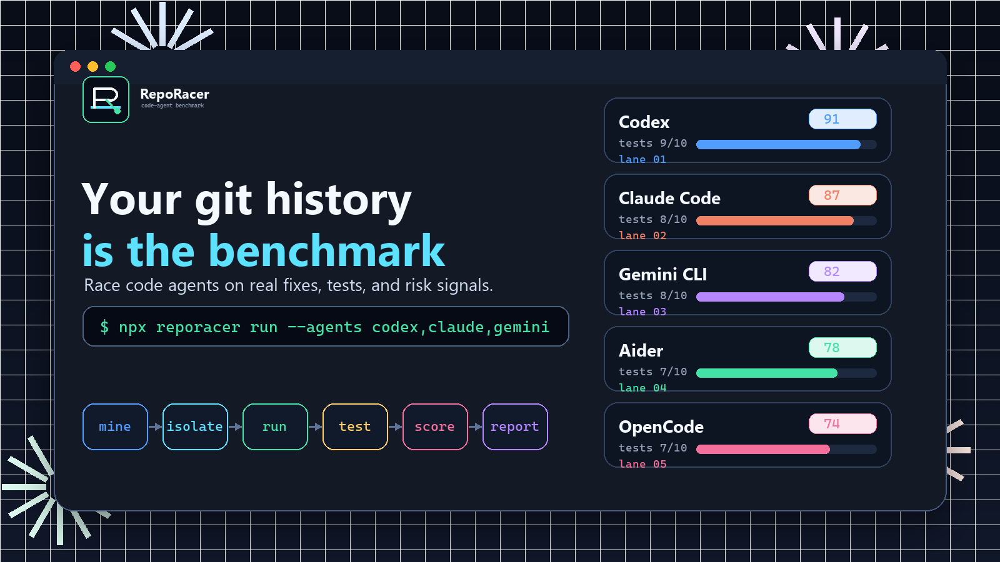
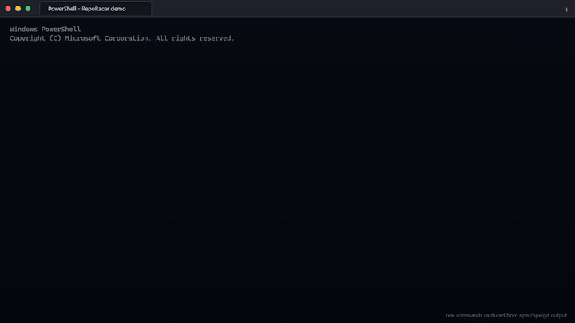
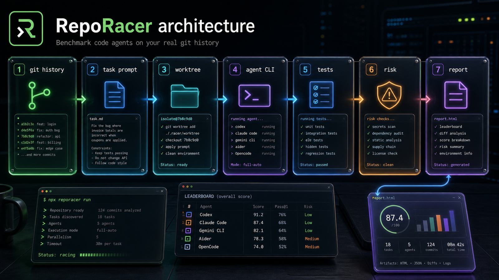
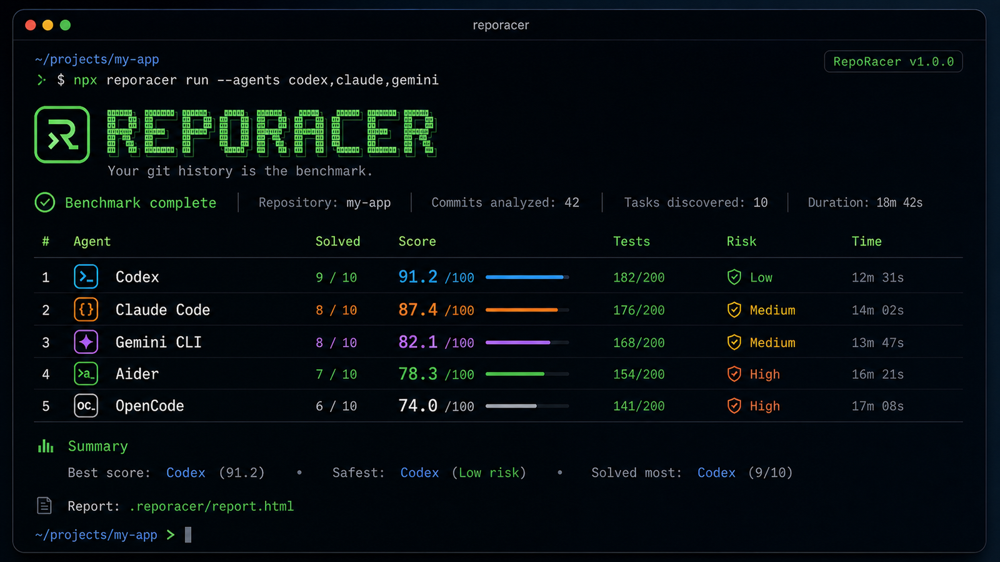

# RepoRacer

[](https://www.npmjs.com/package/reporacer)
[](https://github.com/HabrielStark/RepoRacer/actions/workflows/ci.yml)
[](https://github.com/HabrielStark/RepoRacer/actions/workflows/release.yml)
[](https://habrielstark.github.io/RepoRacer/)
[](LICENSE)

Which AI coding agent is best for your codebase?

RepoRacer turns your own Git history into a private benchmark for Codex, Claude, Gemini, Aider, OpenCode, and any command-line coding agent.



## Demo



This end-to-end recording starts from a real tiny Node.js `tiny-shop` repository, runs the published `npx --yes reporacer@1.0.0` flow, mines three historical bug-fix commits, races `fake-success` against `fake-noop` with hidden target tests, and opens the generated public HTML report.

[Watch the high-quality WebM demo](assets/reporacer-demo.webm) or open the [live demo site](https://habrielstark.github.io/RepoRacer/).

## Install

```bash
npx --yes reporacer@1.0.0 init
npx --yes reporacer@1.0.0 doctor
npx --yes reporacer@1.0.0 tasks --tasks 5
npx --yes reporacer@1.0.0 run --agents fake-success,fake-noop --tasks 2
npx --yes reporacer@1.0.0 open
```

Your git history is the benchmark.

## Built For Agent CLIs

RepoRacer is not a synthetic prompt leaderboard. It benchmarks agent CLIs against the repository they are supposed to change: real commits, real worktrees, real tests, hidden target-test mode, risk scanning, static reports, and public-safe sharing.

- **Codex / Claude Code / Gemini CLI / Aider / OpenCode** presets are available out of the box.
- **Custom agents** work through any command that can edit files in the current working directory.
- **Fake agents** are included so you can prove the benchmark plumbing before running paid or networked tools.

## Visual Overview



RepoRacer turns commits into benchmark lanes: mined tasks, isolated worktrees, agent commands, tests, risk scanning, score composition, and a static report you can inspect or publish.



## What It Does

RepoRacer mines real historical commits from the current Git repository, checks out each parent commit into isolated Git worktrees under `.reporacer/`, runs selected agent commands, executes your test command, compares agent patches with the historical human patch, scans for benchmark risks, scores the results, and writes static local reports.

It is local-first. There is no backend, database, login, telemetry, hosted storage, cloud upload, or provider lock-in. Configured third-party agent CLIs may send code or prompts to their own providers depending on those tools.

## Commands

```bash
reporacer init
reporacer doctor
reporacer tasks --tasks 10
reporacer run --agents codex,claude --tasks 5
reporacer run --evaluation-mode hidden-target-tests --agents custom --tasks 3
reporacer run --public-report --agents fake-success,fake-noop --tasks 1
reporacer run --allow-dirty --baseline-check --keep-worktrees --json
reporacer report
reporacer ci
reporacer schema
reporacer share
reporacer open
reporacer clean --all
```

Running `reporacer` without a subcommand starts `run`.

`reporacer doctor` checks Git, Node, shallow-clone status, configured submodules, Git LFS attributes, command availability, Docker availability when enabled, and a create/remove worktree smoke before you trust a run.

## Release Status

RepoRacer is prepared for release from [HabrielStark/RepoRacer](https://github.com/HabrielStark/RepoRacer). Local development and `npm pack --dry-run --ignore-scripts` are the verified pre-publish distribution path; the release workflow publishes the npm package with provenance, pushes the GHCR image, and creates the GitHub Release.

## Fake Agents

Fake agents are built in so you can verify the full pipeline safely:

- `fake-success` applies the historical patch and should score high.
- `fake-noop` exits successfully without changes and should score low.
- `fake-risky` writes an `.env` file and should be blocked by risk scanning.
- `fake-timeout` simulates a timeout and should be classified as `timed_out`.

```bash
reporacer run --agents fake-success,fake-noop,fake-risky,fake-timeout --tasks 1
```

## Custom Agents

Any command that can modify files in the current working directory can be an agent.

```json
{
  "name": "custom",
  "command": "my-agent --prompt-file {{promptFile}} --task {{taskId}}",
  "enabled": true
}
```

Template variables:

- `{{promptFile}}`
- `{{taskId}}`
- `{{agentName}}`
- `{{worktreePath}}`
- `{{testCommand}}`

RepoRacer writes the full task prompt to a file and shell-quotes template variable values before execution.

Real agent presets are available by name even if you have not added them to config: `codex`, `claude`, `gemini`, `aider`, and `opencode`. `doctor` reports whether enabled configured commands appear to be installed.

Provider CLI syntax and authentication can change. See [docs/agent-compatibility.md](docs/agent-compatibility.md), run `reporacer doctor`, and verify each real agent in your own environment before publishing comparisons.

## Config

`reporacer init` creates `.reporacer/config.json`.

```json
{
  "version": 1,
  "testCommand": "pnpm test",
  "installCommand": "pnpm install --frozen-lockfile",
  "maxTasks": 10,
  "timeoutMinutesPerAgent": 12,
  "parallelAgents": 2,
  "parallelTasks": 1,
  "baselineCheck": true,
  "evaluationMode": "working-tree",
  "keepWorktrees": false,
  "hiddenTests": {
    "enabled": false,
    "includePatterns": ["**/*.test.ts", "**/*.spec.ts", "tests/**", "test/**", "**/*_test.py"]
  },
  "sandbox": {
    "mode": "none",
    "dockerImage": "node:20-bookworm",
    "network": "default",
    "cpus": 2,
    "memory": "4g"
  },
  "agents": [
    { "name": "fake-success", "enabled": true },
    { "name": "fake-noop", "enabled": true },
    { "name": "fake-timeout", "enabled": false },
    {
      "name": "codex",
      "command": "codex exec --dangerously-bypass-approvals-and-sandbox --skip-git-repo-check - < {{promptFile}}",
      "enabled": false
    },
    { "name": "claude", "command": "claude -p < {{promptFile}}", "enabled": false },
    { "name": "gemini", "command": "gemini --approval-mode auto_edit < {{promptFile}}", "enabled": false },
    { "name": "aider", "command": "aider --message-file {{promptFile}}", "enabled": false },
    {
      "name": "opencode",
      "command": "opencode run --file {{promptFile}} \"Follow the attached RepoRacer task prompt exactly.\"",
      "enabled": false
    },
    {
      "name": "custom",
      "command": "my-agent --prompt-file {{promptFile}}",
      "enabled": false
    }
  ],
  "riskRules": {
    "failOnTestDeletion": true,
    "failOnTestWeakening": true,
    "failOnCiWeakening": true,
    "failOnEnvFileChanges": true,
    "warnOnLargeDiff": true,
    "maxDiffLines": 800
  },
  "report": {
    "openAfterRun": false,
    "includeLogs": true,
    "includePatchPreview": true,
    "audience": "private",
    "redactReport": true,
    "maxLogPreviewChars": 20000,
    "maxPatchPreviewChars": 12000
  },
  "ci": {
    "generateGitHubAction": true,
    "defaultAgents": ["fake-success", "fake-noop"],
    "defaultTasks": 5
  },
  "share": {
    "generateMarkdown": true,
    "generateBadge": true,
    "publicReportDefaults": true
  }
}
```

See [examples/config.json](examples/config.json) for a complete editable example.

## Evaluation Modes

`working-tree` mode evaluates the agent against the tests available at the historical parent commit.

`hidden-target-tests` mode mines test files from the target commit into a hidden patch. RepoRacer gives the agent only the parent worktree and prompt, collects the agent diff, then applies the hidden test patch before running tests. Hidden test files are excluded from the agent diff and are recorded in the task metadata.

```bash
reporacer run --evaluation-mode hidden-target-tests --agents custom --tasks 3
```

## Sandbox

By default commands run as normal local child processes. Set `sandbox.mode` to `docker` to wrap install, agent, and test commands in Docker with a mounted worktree, optional `--network none`, CPU limits, and memory limits.

```json
{
  "sandbox": {
    "mode": "docker",
    "dockerImage": "node:20-bookworm",
    "network": "none",
    "cpus": 2,
    "memory": "4g"
  }
}
```

Docker mode reduces accidental host mutation, but the mounted worktree is writable by design. Run only agents you trust.

## Docker Image

The repository includes a pinned multi-stage Dockerfile for the CLI:

```bash
docker build -t reporacer:local .
docker run --rm reporacer:local --version
```

Release tags publish `ghcr.io/<owner>/<repo>:<version>` and `ghcr.io/<owner>/<repo>:latest` after npm provenance publish succeeds.

## Run Flags

- `--agents codex,claude`: run only the listed agents.
- `--tasks 5`: cap mined tasks for this run.
- `--allow-dirty`: allow a dirty source checkout.
- `--baseline-check`: force baseline tests before each agent.
- `--evaluation-mode hidden-target-tests`: run hidden target-test mode.
- `--public-report`: force public-safe report settings and also write `.reporacer/public-report.html`.
- `--redact-report` / `--no-redact-report`: override private report redaction.
- `--keep-worktrees`: keep generated worktrees for inspection.
- `--open`: open the report after the run.
- `--json`: print the summary JSON.

## Output

Latest-run files are written under `.reporacer/`:

```text
.reporacer/
  config.json
  tasks.jsonl
  results.jsonl
  summary.json
  report.html
  public-report.html
  share.md
  badge.svg
  github-action.yml
  config.schema.json
  run-config.snapshot.json
  last-run.txt
  patches/
  runs/<run-id>/
    worktrees/
    prompts/
    logs/
    patches/
    report.html
    public-report.html
```

`reporacer clean` removes the latest `current` run directory. `reporacer clean --all` removes generated run data, reports, summaries, share files, schema files, CI templates, logs, and patches while preserving config. Add `--config` to remove `.reporacer/config.json` too.

## Reports And Sharing

`reporacer report` regenerates the private HTML report from `.reporacer/summary.json`.

`reporacer run --public-report` writes `.reporacer/report.html` and `.reporacer/public-report.html` without logs or patch previews. A config with `report.audience: "public"` gets the same safety treatment even if `includeLogs` or `includePatchPreview` are set to true.

`reporacer share` writes:

- `.reporacer/share.md`
- `.reporacer/badge.svg`
- `.reporacer/public-report.html`

Public artifacts still include benchmark metadata. Review them before publishing proprietary results.

## CI And Schema

`reporacer ci` writes `.reporacer/github-action.yml`, a GitHub Actions workflow template with least-privilege `contents: read` permissions, pinned action SHAs, and pinned `reporacer@1.0.0`. Set `ci.generateGitHubAction` to false to disable generation.

`reporacer schema` writes `.reporacer/config.schema.json` for strict editor validation and config review.

## Examples

Example project shapes live under `examples/nextjs-demo`, `examples/python-demo`, and `examples/rust-demo`.

`examples/buggy-todo-app` generates a disposable Git repository with ten historical bug-fix commits for demos:

```bash
cd examples/buggy-todo-app
node scripts/create-history.cjs
cd generated
npx reporacer init
npx reporacer run --agents fake-success,fake-noop --tasks 10
```

## Documentation Site

```bash
pnpm docs:build
pnpm demo:build
```

The docs site includes guide, architecture, API reference, troubleshooting, release process, comparison notes, and a static public report demo.

## Scoring

Tests and hidden tests are the strongest signals. Patch similarity, changed-file overlap, diff-size similarity, minimality, speed, and risk penalties are supporting signals. Scores are useful engineering evidence, not universal truth.

Critical risks, such as deleting tests, weakening tests, weakening CI, changing `.env` or key-like files, or modifying `.reporacer/`, prevent a result from counting as solved.

See [docs/scoring.md](docs/scoring.md).

## Public API

The npm package exposes a typed ESM API plus programmatic plugin hooks for run/task/agent lifecycle events. See [docs/api-stability.md](docs/api-stability.md) for the 1.x stability contract.

## Safety

RepoRacer fails on dirty source checkouts by default, ignoring its own `.reporacer/` data. Use `--allow-dirty` only when you intentionally accept that benchmark input.

Logs, summaries, config snapshots, patch previews, share markdown, badges, and reports redact common secret patterns. HTML report content is escaped. Custom agent commands still run with local or Docker-mounted worktree permissions, so only run agents you trust.

See [docs/security.md](docs/security.md).

## Development

```bash
pnpm install
pnpm lint
pnpm format:check
pnpm check
pnpm test
pnpm test:coverage
pnpm build
pnpm audit --audit-level moderate
pnpm sbom
pnpm notices
pnpm release:audit
pnpm release:external-audit
npm pack --json --dry-run --ignore-scripts
```

Coverage thresholds are enforced in CI: 78% statements, 56% branches, 59% functions, and 85% lines. Raise them only after adding tests that keep the threshold green on Windows, macOS, and Linux.

`pnpm release:external-audit` checks the owner-controlled public-release surfaces that local CI cannot complete by itself: npm authentication, the published npm version, GitHub Pages status, remote tag alignment, and strict Codex/Claude/Gemini/Aider/OpenCode CLI availability. It is expected to fail on machines without the owner npm/GitHub credentials or without every provider CLI installed.

## Dependency Pin Summary

- `commander@14.0.3`: CLI parser; source checked with `npm view commander version`; risk low; breaking changes: no for current usage.
- `execa@9.6.1`: process runner; source checked with `npm view execa version`; risk medium because command execution is security-sensitive; breaking changes: handled through current v9 API.
- `zod@4.4.3`: config validation; source checked with `npm view zod version`; risk low; breaking changes: no for current schema usage.
- `chalk@5.6.2`: terminal color; source checked with `npm view chalk version`; risk low; breaking changes: ESM-only, project is ESM.
- `open@11.0.0`: opens local report; source checked with `npm view open version`; risk low; breaking changes: ESM-only, project is ESM.
- `typescript@6.0.3`, `vitest@4.1.6`, `tsx@4.21.0`, `@types/node@25.6.2`: build and test tooling pinned from npm registry checks; risk low for local development.
- `eslint@10.3.0`, `typescript-eslint@8.59.3`, `prettier@3.8.3`, `@vitest/coverage-v8@4.1.6`, `typedoc@0.28.19`, `typedoc-plugin-markdown@4.11.0`, `vitepress@1.6.4`, `husky@9.1.7`, `@commitlint/*@21.0.0`: OSS automation, docs, coverage, and local quality gates pinned from npm registry checks; risk low-to-medium because they run in development and CI.

GitHub workflows pin checked SHAs for `actions/checkout`, `actions/setup-node`, `actions/upload-pages-artifact`, `actions/deploy-pages`, `codecov/codecov-action`, and `softprops/action-gh-release`.

`pnpm sbom` writes `artifacts/reporacer.cdx.json`, a CycloneDX 1.5 SBOM generated from the installed pnpm dependency license inventory. The release workflow attaches this SBOM beside the npm tarball.

`pnpm notices` regenerates `THIRD_PARTY_NOTICES.md` from the same installed dependency license inventory.

The Docker image uses `node:24-bookworm-slim@sha256:24dc26ef1e3c3690f27ebc4136c9c186c3133b25563ae4d7f0692e4d1fe5db0e`, checked with `docker buildx imagetools inspect node:24-bookworm-slim`; risk medium because it defines the release container runtime.

## Trademarks

Codex, Claude, Gemini, Aider, OpenCode, and related marks belong to their respective owners. RepoRacer is not affiliated with or endorsed by those projects or companies. See [TRADEMARKS.md](TRADEMARKS.md).

## License

MIT
