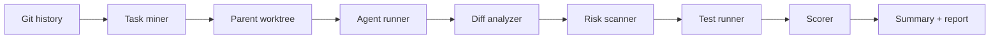

# Architecture

## Modules

- `src/core/git.ts`: safe Git command helpers, commit scanning, patches, worktrees.
- `src/core/task-miner.ts`: converts historical commits into benchmark tasks.
- `src/core/agent-runner.ts`: creates worktrees, renders prompts, runs install/agent/test commands, records logs.
- `src/core/risk-scanner.ts`: rejects benchmark invalidation risks.
- `src/core/scorer.ts`: combines tests, hidden tests, patch similarity, changed files, minimality, speed, and risk penalties.
- `src/report/template.ts`: static HTML report generation with escaping and redaction.
- `src/commands/*.ts`: CLI command surfaces.

## Data Flow

RepoRacer writes owned artifacts under `.reporacer/`. Source checkouts are dirty-checked before runs, and generated paths are excluded from that check.

Hidden target-test mode mines test-file changes from the target commit, runs the agent without exposing those test changes, then applies the hidden patch before tests.
