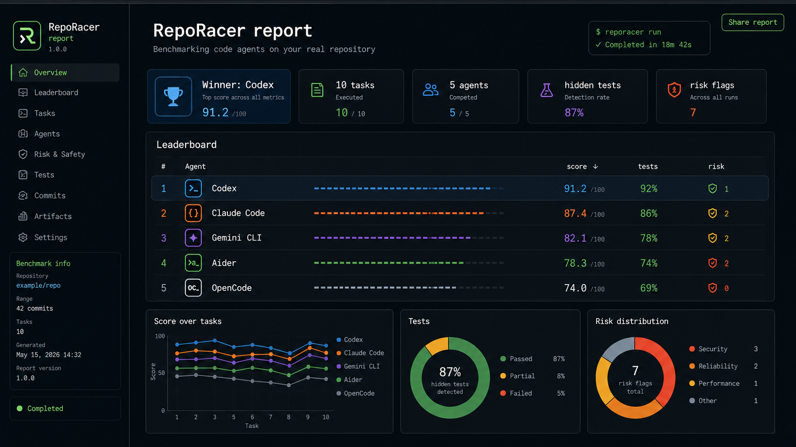

## Watch It Run

This is an end-to-end terminal recording: clone RepoRacer, generate the real `examples/buggy-todo-app` repository with ten historical bug-fix commits, install with `npx`, preflight with `doctor`, mine five hidden-target-test tasks, run the benchmark, and write the shareable public report.

<video controls muted playsinline poster="https://habrielstark.github.io/RepoRacer/reporacer-demo-poster.png" style="width:100%;border-radius:14px;border:1px solid rgba(125, 211, 252, 0.25);box-shadow:0 20px 60px rgba(2, 6, 23, 0.24);">
  <source src="https://habrielstark.github.io/RepoRacer/reporacer-demo.webm" type="video/webm" />
  <a href="https://habrielstark.github.io/RepoRacer/reporacer-demo.gif">Watch the RepoRacer demo GIF.</a>
</video>

## See The Pipeline

